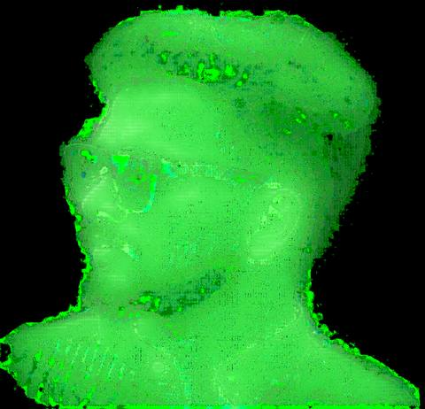

<div align="center">

<h1>⌁ NIJOY-P-JOSE // TERMINAL PROFILE ⌁</h1>

<p>
  
</p>

<pre>
01001001 01001110 01001001 01001111 01011001

> booting Nijoy.exe ...
> role  : Computer Science & Engineering Student
> focus : Full-Stack · AI/LLM · Agentic AI · Cybersecurity
> mode  : BUILD / LEARN / BREAK / FIX
</pre>

<p>
  <a href="https://github.com/NIJOY-P-JOSE">
    
  </a>
  <a href="https://www.linkedin.com/in/nijoy-p-jose/">
    
  </a>
  <a href="mailto:nijoypjose@gmail.com">
    
  </a>
  <a href="https://leetcode.com/u/Nijoy/">
    
  </a>
</p>

</div>

---

## `whoami`

```text
Nijoy P. Jose
Computer Science & Engineering — VAST, KTU
Diploma background — Computer Hardware Engineering
Location — Thrissur, Kerala, India 🇮🇳

$ ./current_status

[+] final-year B.Tech CSE student
[+] building AegisSys — explainable multi-agent cybersecurity AI
[+] building full-stack systems with Django / DRF / Next.js
[+] exploring cybersecurity, LLM systems, RAG & agentic workflows
[+] solving DSA problems and preparing for software placements
[+] mentoring beginners through web-development workshops
```

> From circuit boards → full-stack systems → AI agents.

---

## ░▒▓ ABOUT ▓▒░

```yaml
focus:
  - Full-Stack Development
  - AI / LLM Systems
  - Agentic AI
  - Cybersecurity

currently_building:
  - AegisSys
  - Mutual Fund Tracker

engineering_style:
  - explainable
  - practical
  - safety-first
  - user-controlled

fun_fact: "I started by debugging hardware. Now I debug software that debugs software."
```

---

## █ PROJECTS

### 01 // 🛡️ AegisSys
**Explainable Multi-Agent AI for Cybersecurity Assessment**

```text
Collector
   ↓
Threat / Risk Analysis
   ↓
Explainability + RAG
   ↓
Remediation Planning
   ↓
Safety Validation
   ↓
Human Approval
   ↓
Trusted Execution
   ↓
Verification
```

**Stack:** Python · LangGraph · LangChain · Ollama · RAG  
**Status:** ACTIVE DEVELOPMENT

[→ Repository](https://github.com/NIJOY-P-JOSE/AegisSys)

---

### 02 // 💰 Mutual Fund Tracker
**Personal-finance / mutual-fund focused application**

```text
fund discovery → portfolio data → calculations → insights
```

A newer build focused on making Indian mutual-fund tracking and analysis easier through software.

**Status:** LATEST BUILD / IN PROGRESS

---

### 03 // ⚙️ Event Approval Workflow
**Full-Stack Institutional Workflow Platform**

```text
Faculty
  ↓
Coordinator
  ↓
Submit
  ↓
Department Head
  ↓
HOD
  ↓
Final Approval
```

Role-based access, JWT authentication, event CRUD, structured approval flow and status tracking.

**Stack:** Next.js · React · Django · Django REST Framework · JWT · SQLite

[→ Repository](https://github.com/NIJOY-P-JOSE/event-approval-system)

---

### 04 // 🚆 OptiRail
**AI-Driven Train Scheduling System for Kochi Metro**

Automates daily train induction planning using fleet data, ranking / optimization logic, OCR-assisted document intelligence, dashboards and role-based access.

**Stack:** Python · Django · DRF · PostgreSQL · Docker

[→ Repository](https://github.com/NIJOY-P-JOSE/OptiRail)

---

### 05 // 📍 Smart Field Visit Planner
**Distance-Aware Field Operations Optimization**

Team assignment, visit scheduling, route planning, revisit handling and cost estimation, with ML-based optimization work in progress.

**Stack:** Python · Django · JavaScript · SQLite / MySQL

[→ Repository](https://github.com/NIJOY-P-JOSE/field-visit-planner)

---

### 06 // 🎓 VidyaVault
**AI-Powered Academic Project Repository**

Student project showcase with search, faculty evaluation, dashboards, leaderboard, comments and a Gemini-powered assistant for project-specific Q&A.

**Stack:** Django · Python · Vertex AI / Gemini · GitHub API · Bootstrap · SQLite / PostgreSQL

[→ Repository](https://github.com/NIJOY-P-JOSE/VidyaVault)

---

### 07 // 🤖 Beard Wizard
**AI + Computer Vision Grooming Assistant**

Real-time webcam processing that overlays beard-trimming guides using OpenCV and MediaPipe.

**Stack:** Python · Django · OpenCV · MediaPipe · NumPy · JavaScript

[→ Repository](https://github.com/NIJOY-P-JOSE/beard-wizard)

---

### 08 // 🦾 VR Telepresence Robot
**IoT + Computer Vision Academic Project**

Head-motion-controlled pan/tilt camera system with wireless control and video streaming.

**Stack:** ESP32 · Arduino · MPU6050 · HC-05 · Blynk · Python · Flask · OpenCV

---

## ░▓ SKILLS ▓░

<div align="center">

### Languages


### Web / Backend


### AI / LLM


### Data / Tools


</div>

---

## `git log --stat`

<div align="center">


<br/>


</div>

---

## `./achievements`

```text
[+] 90+ DSA problems solved
[+] 2nd Prize — Web Designing, Citadel State Fest
[+] Smart India Hackathon participant
[+] Stride / inclusive-tech hackathon participation
[+] AI Skills Passport — EY & Microsoft
[+] NPTEL Java certification
[+] Web-development workshop mentor
```

---

## ░▒▓ NOW LOADING ▓▒░

```text
AegisSys .................... [██████████████████░░] active
Mutual Fund Tracker ......... [███████████████░░░░░] building
Cybersecurity ............... [████████████░░░░░░░░] learning
System Design ............... [██████████░░░░░░░░░░] learning
DSA ......................... [█████████████░░░░░░░] grinding

> next_target: build better systems, not just more systems.
```

---

<div align="center">

### `connect --nijoy`

<a href="https://github.com/NIJOY-P-JOSE">GitHub</a>
&nbsp;·&nbsp;
<a href="https://www.linkedin.com/in/nijoy-p-jose/">LinkedIn</a>
&nbsp;·&nbsp;
<a href="mailto:nijoypjose@gmail.com">Email</a>
&nbsp;·&nbsp;
<a href="https://leetcode.com/u/Nijoy/">LeetCode</a>

<br/><br/>

<sub>01001001 01001110 01001001 01011001</sub>

</div>
