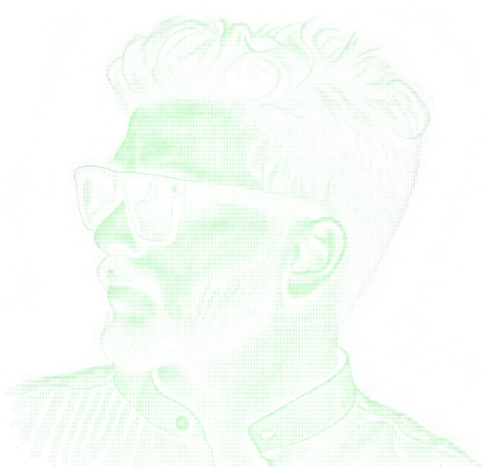

<div align="center">

# `NIJOY-P-JOSE // TERMINAL`

```text
╭──────────────────────────────────────────────────────────────────────╮
│  nijoy@github:~$ ./profile                                          │
│                                                                      │
│  01001001 01001110 01001001 01001111 01011001                     │
│                                                                      │
│  > booting Nijoy.exe ...                                            │
│  > role    : Computer Science & Engineering Student                │
│  > focus   : Full-Stack · AI/LLM · Agentic AI · Cybersecurity       │
│  > mode    : BUILD / LEARN / BREAK / FIX                            │
╰──────────────────────────────────────────────────────────────────────╯
```



### `BUILDING SOFTWARE THAT EXPLAINS ITSELF.`

<p>
  <a href="https://github.com/NIJOY-P-JOSE">
    
  </a>
  <a href="https://www.linkedin.com/in/nijoy-p-jose/">
    
  </a>
  <a href="mailto:nijoypjose@gmail.com">
    
  </a>
  <a href="https://leetcode.com/u/Nijoy/">
    
  </a>
</p>

</div>

---

## `> whoami`

<table>
<tr>
<td width="58%" valign="top">

```yaml
name: Nijoy P. Jose
location: Thrissur, Kerala, India

education:
  degree: B.Tech CSE
  institute: VAST
  university: KTU
  mode: Lateral Entry
  graduation: May 2027

background:
  diploma: Computer Hardware Engineering

focus:
  - Full-Stack Development
  - AI / LLM Systems
  - Agentic AI
  - Cybersecurity

currently:
  - Building AegisSys
  - Building MutualFund
  - Learning cybersecurity
  - Grinding DSA
```

</td>
<td width="42%" valign="top">

```text
┌─ /profile/status ───────────┐
│                             │
│  ● ONLINE                   │
│                             │
│  repositories    16         │
│  commits         600+       │
│  pull requests   9          │
│  contributions   450+       │
│  followers       16         │
│  stars           14         │
│                             │
│  status: BUILDING           │
└─────────────────────────────┘
```

</td>
</tr>
</table>

> `From circuit boards → full-stack systems → AI agents.`

---

## `> ./about`

```text
┌────────────────────────────────────────────────────────────────────────────┐
│                                                                            │
│  I’m a final-year Computer Science student who enjoys building practical │
│  software at the intersection of full-stack development, AI and security.│
│                                                                            │
│  My background started with hardware and embedded systems. Today I build  │
│  web applications, AI-assisted tools, LLM workflows and security-focused  │
│  systems.                                                                  │
│                                                                            │
│  I like taking an idea from                                            │
│                                                                            │
│       idea → architecture → code → testing → working system              │
│                                                                            │
└────────────────────────────────────────────────────────────────────────────┘
```

### `> currently_learning`

`CYBERSECURITY` `SYSTEM DESIGN` `DSA` `AGENTIC AI` `LLM SYSTEMS`

---

# `> PROJECTS`

<div align="center">

### `01` 🛡️ **AegisSys**
**Explainable Multi-Agent AI for Cybersecurity Assessment**

</div>

```text
                     ┌─────────────────┐
                     │  SYSTEM DATA    │
                     └────────┬────────┘
                              ↓
                     ┌─────────────────┐
                     │   ASSESSMENT    │
                     └────────┬────────┘
                              ↓
              ┌───────────────┼───────────────┐
              ↓               ↓               ↓
        THREAT AGENT     RISK AGENT      RAG / KB
              └───────────────┼───────────────┘
                              ↓
                     ┌─────────────────┐
                     │ EXPLAINABILITY  │
                     └────────┬────────┘
                              ↓
                     ┌─────────────────┐
                     │ REMEDIATION     │
                     └────────┬────────┘
                              ↓
                     ┌─────────────────┐
                     │ SAFETY CHECK    │
                     └────────┬────────┘
                              ↓
                     👤 HUMAN APPROVAL
                              ↓
                     TRUSTED EXECUTION
                              ↓
                         VERIFICATION
```

**Stack:** `Python` `LangGraph` `LangChain` `Ollama` `RAG`

[**→ View AegisSys**](https://github.com/NIJOY-P-JOSE/AegisSys)

---

<div align="center">

### `02` 💰 **MutualFund**
**Mutual Fund Analysis & Tracking Platform**

</div>

```text
       FUND DATA
           │
           ▼
    ┌──────────────┐
    │   ANALYSIS   │
    └──────┬───────┘
           ↓
    ┌──────────────┐
    │  PORTFOLIO   │
    └──────┬───────┘
           ↓
    ┌──────────────┐
    │ INSIGHTS /   │
    │ PERFORMANCE  │
    └──────────────┘
```

A newer project focused on making mutual-fund data, portfolio tracking and analysis easier to understand.

**Status:** `LATEST BUILD`

> Replace the repository URL above with the exact MutualFund repository once it is public.

---

<div align="center">

### `03` ⚙️ **Event Approval Workflow**
**Full-Stack Institutional Workflow Platform**

</div>

```text
Faculty
   │
   ▼
Coordinator → Update → Submit
                       │
                       ▼
                 Department Head
                       │
                       ▼
                      HOD
                       │
                       ▼
                 FINAL APPROVAL
```

Role-based access, JWT authentication, event CRUD, coordinator workflows and multi-stage approval tracking.

**Stack:** `Next.js` `React` `Django` `DRF` `JWT` `SQLite`

[**→ View Repository**](https://github.com/NIJOY-P-JOSE/event-approval-system)

---

<div align="center">

### `04` 🚆 **OptiRail**
**AI-Driven Train Scheduling System for Kochi Metro**

</div>

An intelligent decision-support platform for train induction and scheduling, combining operational data, ranking/optimization, OCR-assisted documents, dashboards and role-based access.

**Stack:** `Python` `Django` `DRF` `PostgreSQL` `Docker`

[**→ View Repository**](https://github.com/NIJOY-P-JOSE/OptiRail)

---

<div align="center">

### `05` 📍 **Smart Field Visit Planner**
**Distance-Aware Field Operations Optimization**

</div>

Team assignment, location management, route planning, visit scheduling, revisit planning and cost estimation, with ML-based optimization work.

**Stack:** `Python` `Django` `JavaScript` `SQLite` `MySQL`

[**→ View Repository**](https://github.com/NIJOY-P-JOSE/field-visit-planner)

---

<div align="center">

### `06` 🎓 **VidyaVault**
**AI-Powered Academic Project Repository**

</div>

A project showcase platform with search, faculty evaluation, dashboards, leaderboard, comments and a Gemini-powered assistant for project-specific Q&A.

**Stack:** `Django` `Python` `Vertex AI / Gemini` `GitHub API` `Bootstrap`

[**→ View Repository**](https://github.com/NIJOY-P-JOSE/VidyaVault)

---

<div align="center">

### `07` 🤖 **Beard Wizard**
**AI + Computer Vision Grooming Assistant**

</div>

Real-time webcam processing that overlays beard-trimming guides using computer vision.

**Stack:** `Python` `Django` `OpenCV` `MediaPipe` `NumPy` `JavaScript`

[**→ View Repository**](https://github.com/NIJOY-P-JOSE/beard-wizard)

---

<div align="center">

### `08` 🦾 **VR Telepresence Robot**
**IoT + Computer Vision Academic Project**

</div>

Head-motion-controlled pan/tilt camera with wireless control and video streaming.

**Stack:** `ESP32` `Arduino` `MPU6050` `HC-05` `Blynk` `Python` `Flask` `OpenCV`

---

# `> ./tech-stack`

<div align="center">

### `LANGUAGES`


### `WEB / BACKEND`


### `AI / LLM`


### `DATABASES / TOOLS / EMBEDDED`


</div>

---

# `> git stats`

<div align="center">


<br/>


</div>

---

# `> ./achievements`

<table>
<tr>
<td align="center">🏆<br/><b>90+</b><br/>LeetCode Problems</td>
<td align="center">🥈<br/><b>2nd Prize</b><br/>Web Designing</td>
<td align="center">🚀<br/><b>Hackathons</b><br/>SIH · Stride</td>
<td align="center">📜<br/><b>Certifications</b><br/>EY · Microsoft · NPTEL</td>
</tr>
</table>

---

# `> ./currently`

```text
┌──────────────────────────────────────────────────────────────────────┐
│                                                                      │
│  [██████████████████░░]  AegisSys             → BUILDING            │
│  [████████████████░░░░]  MutualFund           → BUILDING            │
│  [██████████████░░░░░░]  Cybersecurity        → LEARNING            │
│  [████████████░░░░░░░░]  System Design        → LEARNING            │
│  [██████████████░░░░░░]  DSA                  → GRINDING            │
│                                                                      │
│  > next_target: build better systems, not just more systems.       │
│                                                                      │
└──────────────────────────────────────────────────────────────────────┘
```

---

<div align="center">

## `> connect --nijoy`

<a href="https://github.com/NIJOY-P-JOSE">`GitHub`</a>
&nbsp;&nbsp;•&nbsp;&nbsp;
<a href="https://www.linkedin.com/in/nijoy-p-jose/">`LinkedIn`</a>
&nbsp;&nbsp;•&nbsp;&nbsp;
<a href="mailto:nijoypjose@gmail.com">`Email`</a>
&nbsp;&nbsp;•&nbsp;&nbsp;
<a href="https://leetcode.com/u/Nijoy/">`LeetCode`</a>

<br/><br/>

```text
01001001 01001110 01001001 01001111 01011001

[ SYSTEM ONLINE ]
[ KEEP BUILDING... ]
```

### `// END OF PROFILE`

</div>
